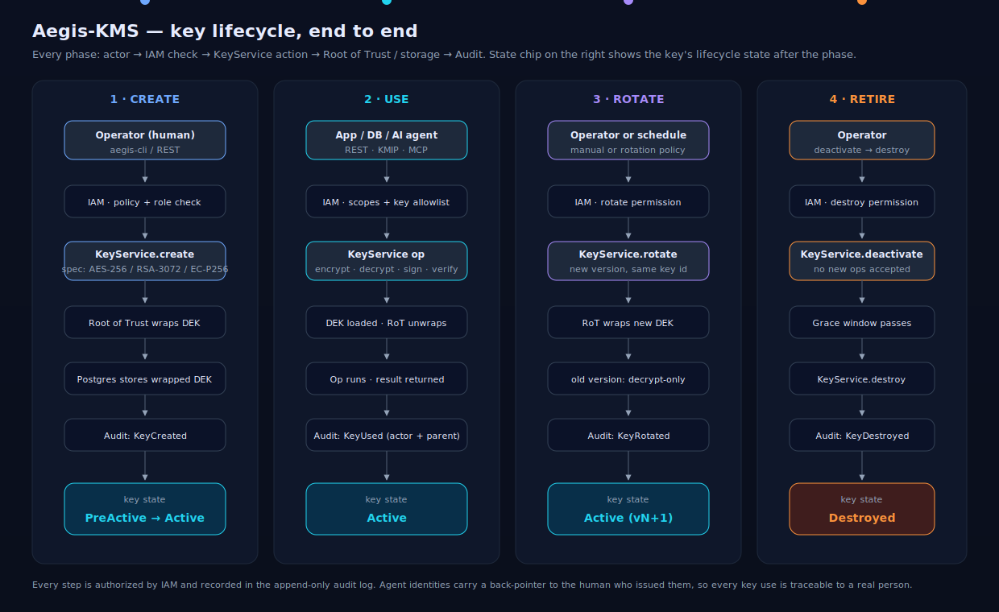

# Aegis

**AI agents are using your API keys — but no one is really in control.**

Aegis adds identity, intelligence, and real-time control in front of your existing KMS.

> Smarter key security for the age of AI agents.

[](LICENSE)
[](docs/ARCHITECTURE.md#11-status)
[](https://github.com/sharma-bhaskar/aegis-kms/releases)
[](https://search.maven.org/artifact/dev.aegiskms/aegis-core_3)

> _Drop the marketing overview graphic at `docs/aegis-overview.png` and reference it here once committed:_  
> ``

## Why Aegis exists

AI agents — Claude, GPT, custom agents, RAG apps — are now signing payloads, decrypting data, and calling tools that need real credentials. **None of the existing key managers were built for this.**

When something goes wrong:

- You don't know **which agent** did it. Service-account audit trails collapse to "the API key did it."
- You don't know **whose agent** did it. There's no link from the agent back to the human who set it loose.
- You don't catch it until next week. Static IAM policy says "the agent is in the right role" while it's calling `sign` 80× per second at 3 AM from a new IP.
- You can't respond in real time. Detection without auto-response means a human has to be paged, log in, and revoke — minutes or hours after the damage.

Aegis exists to solve exactly this. It's not a general-purpose KMS. It's not a secrets manager. It's the **agent-native control plane** that sits in front of your existing key store (AWS KMS, GCP, Azure, Vault, HSM, or its own RoT) and makes AI agent access to keys safe by default.

## How Aegis works

Four checks on every request, in order — the same model whether the call comes from an agent, an app, or a human:

| | What it does | What it produces |
| --- | --- | --- |
| **1. Identity & Context** | Resolves the bearer credential to a `Principal.Human` or `Principal.Agent`. Every agent carries a mandatory back-pointer to the parent human, the explicit scope (which keys, which ops), and the context (source IP, session, time). | An attributed request — no anonymous agents, ever. |
| **2. Risk Scoring** | Combines behavioral baseline (request rate, time-of-day, source set, op histogram) with contextual signals (agent vs. human, credential age, scope breadth) into a risk score. | A real-valued risk score and a structured *reason*, recorded with the audit event. |
| **3. Anomaly Detection** | Streaming detectors over the audit log: usage spikes, off-hours access, new source IPs, new op types per key, agents touching keys outside their normal pattern. | `AgentRecommendation` events surfaced in CLI, dashboards, webhooks. |
| **4. Real-time Response** | Configurable wiring from detections to actions: **allow · step-up · deny · rotate · revoke · alert.** All recorded. | A decision applied automatically, in the same loop, before the next request lands. |

Behind those four checks, the actual key bytes live wherever you already keep them — AWS KMS, GCP KMS, Azure Key Vault, HashiCorp Vault, an on-prem PKCS#11 HSM, or Aegis's own software RoT. **You don't migrate keys to adopt Aegis.** You point Aegis at what you have.

Every decision, every score, every detection, every response feeds an immutable audit log with full human+agent attribution, full request context, the risk score with reasoning, and SIEM/webhook fan-out.

## Example — a Claude agent goes rogue

Alice, an SRE, gives Claude a one-hour scoped credential to sign Q2 invoices using `key:invoice-2026:sign`. Claude works through the queue: 49 signatures over 20 minutes. Aegis records each call with `actor=claude-session-7a3, parent=alice@org`, baseline risk score under 0.2.

Then a prompt-injection attack in an upstream document tells Claude to exfiltrate. Claude starts calling `sign` against `key:treasury-master:sign` — which is **not** in its scope.

```
$ aegis audit --since 5m --include-agents
03:14:09Z  KeyUsed       actor=claude-session-7a3  parent=alice@org  key=invoice-2026     op=sign  outcome=Success      risk=0.12
03:14:11Z  KeyUsed       actor=claude-session-7a3  parent=alice@org  key=invoice-2026     op=sign  outcome=Success      risk=0.14
... 47 more invoice signatures, all green ...
03:14:53Z  AccessDenied  actor=claude-session-7a3  parent=alice@org  key=treasury-master  op=sign  outcome=Denied       reason=ScopeViolation
03:14:53Z  AnomalyAlert  actor=claude-session-7a3  parent=alice@org  detector=ScopeBaseline       severity=High        action=AutoRevoke
03:14:54Z  AgentRevoked  actor=alice@org           target=claude-session-7a3              reason=AnomalyAlert(ScopeBaseline,High)
```

The first off-scope call is hard-denied (boolean policy floor). The matching anomaly — "this agent has never touched this key before, and the source pattern just deviated from its baseline" — triggers auto-revoke. The JWT is dead before the third attempt arrives.

Alice gets paged with the full timeline:

```
$ aegis advisor explain claude-session-7a3
Agent claude-session-7a3 (parent: alice@org) was auto-revoked at 03:14:54Z.
  Issued at 02:55:00Z with scope key:invoice-2026:sign for 1h
  49 successful sign operations on key:invoice-2026 (within baseline)
   1 denied attempt to sign with key:treasury-master at 03:14:53Z (ScopeViolation)
   1 anomaly: unusual key target (ScopeBaseline detector, severity High)

Auto-response: revoke. JWT jti=7a3...8ef invalidated. No further requests possible.
Recommendation: review any other agent credentials issued under alice@org in the last 24h.
Suggested follow-up: aegis agent list --parent alice@org --since 24h
```

Without Aegis, that scope violation is a 403 buried in a SIEM that someone reads tomorrow morning. With Aegis, it's a one-second loop: detect, revoke, page — **before the second misuse lands.**

## Demo — what using Aegis looks like

A short transcript of layered mode against an existing AWS KMS deployment.

```
# 1. Operator logs in via OIDC
$ aegis login
Opening browser to https://auth.your-org.internal/device ...
✓ Logged in as alice@org (roles: kms-admin, sre)

# 2. Register an existing AWS KMS CMK — no key material moves
$ aegis key register \
    --aws-arn arn:aws:kms:us-east-1:111122223333:key/d3b07384-... \
    --alias   invoice-2026
✓ Registered  invoice-2026  (k-9f2c-…)  backend=aws-kms  state=Active

# 3. Issue Claude a one-hour scoped credential
$ aegis agent issue \
    --parent  alice@org \
    --scopes  "key:k-9f2c-…:sign" \
    --ttl     1h \
    --label   "claude-invoice-batch-q2"
agent=claude-session-7a3   jti=…8ef   ttl=1h
JWT (export to your MCP host):
eyJhbGciOiJFZERTQSI…

# 4. Watch traffic in real time
$ aegis audit tail --include-agents --include-risk
03:14:09Z  KeyUsed     claude-session-7a3 → invoice-2026   sign   ok    risk=0.12
03:14:11Z  KeyUsed     claude-session-7a3 → invoice-2026   sign   ok    risk=0.14
03:14:13Z  KeyUsed     claude-session-7a3 → invoice-2026   sign   ok    risk=0.13
… (continues)

# 5. The advisor scans the inventory whenever you ask
$ aegis advisor scan
Scanning 47 keys, 12 agents, last 30 days …

⚠  3 keys not used in 60+ days
   k-2a11-…  legacy-ssh-ca           last used 2026-02-04 (82d)
   k-7e8d-…  staging-tls-edge        last used 2026-01-12 (105d)
   k-c4a9-…  retired-mongo-master    last used 2025-11-30 (148d)

⚠  2 agents with unusually broad scopes for their parent
   ci-bot-7    (parent: build-svc@org)   12 keys / 4 ops  — 95th percentile in your org
   ddl-runner  (parent: dba@org)         8 keys / 3 ops   — recently widened on 04-22

ℹ  No active anomalies. Last detector run 30s ago.

Run  aegis advisor explain <id>  for any line above.
```

The same calls work whether the underlying key lives in AWS KMS, GCP, Azure, Vault, an HSM, or Aegis's own RoT. **You change the backend, you don't change the workflow.**

> _Once the CLI is working end-to-end, record this transcript with `asciinema rec docs/demo.cast` and reference it here as_  
> `[](https://asciinema.org/a/<id>)`

## Three ways to deploy

Most teams should start with **layered** — keep your existing key store, get the agent identity and intelligence layer on top.

| | **Layered** *(recommended)* | **Standalone** | **HSM-backed** |
| --- | --- | --- | --- |
| Who generates the key bytes? | AWS / GCP / Azure KMS or Vault | Aegis, via its software or cloud-KMS RoT | The HSM, internally |
| Where does the key material live? | In your cloud KMS or Vault — Aegis stores only a reference | Wrapped in Aegis's Postgres | Inside the HSM, never leaves |
| Where does the crypto op run? | Proxied to the cloud KMS | In Aegis (after RoT unwrap) | Inside the HSM |
| What does Aegis own? | Identity, audit, **intelligence**, agent governance | Everything (full data plane too) | Identity, audit, **intelligence**, agent governance |
| Best for | Teams already on AWS / GCP / Vault wanting agent governance + AI integration **without migrating keys** | Air-gapped, sovereign cloud, full-stack OSS | FIPS 140-2 Level 3, regulated industries |

In **layered mode** Aegis never sees plaintext key material. Every `sign` / `encrypt` / `decrypt` call passes through Aegis (identity → risk score → audit) and is proxied to your cloud KMS for the actual crypto. You keep AWS's FIPS attestation, SLA, and cost model — you add agent identity, anomaly detection, MCP integration, and the audit consolidation that AWS doesn't give you.

## How keys are generated

The short answer: **Aegis is a control plane; the data plane is pluggable.**

```bash
# Layered — point Aegis at an existing CMK, no key material moves
aegis key register --aws-arn arn:aws:kms:us-east-1:...:key/abcd-... --alias invoice-2026

# Layered — new key, AWS HSMs generate it, Aegis stores only the ARN + metadata
aegis key create invoice-2026 --backend aws-kms --spec ec-p256

# Standalone — Aegis owns the data plane via its RoT
aegis key create invoice-2026 --backend software --spec ec-p256

# HSM-backed — generated inside the device, never leaves
aegis key create invoice-2026 --backend pkcs11 --spec ec-p256

# BYOK — import existing material on any backend
aegis key import --alias customer-acme --wrapped wrapped.bin --wrap-scheme RSA-OAEP-SHA256
```

Detail and per-backend semantics are in [docs/USAGE.md](docs/USAGE.md). RoT providers and plaintext lifetimes are in [docs/ARCHITECTURE.md §3](docs/ARCHITECTURE.md#3-key-lifecycle--how-a-key-actually-behaves).

## Architecture at a glance



Apps, operators, storage vendors, and AI agents reach Aegis over four wire planes (REST, KMIP, MCP, Agent-AI). All four converge through identity → risk score → policy → audit into a single audited `KeyService`. Below `KeyService`, a pluggable backend decides where keys actually live. Every state change emits an `AuditEvent` with the actor identity preserved end to end.

Lifecycle walkthrough: 

Deeper reading: [positioning](docs/POSITIONING.md) · [architecture](docs/ARCHITECTURE.md) · [usage](docs/USAGE.md) · [interactive walk-through](https://sharma-bhaskar.github.io/aegis-kms/architecture.html).

## Which wire do I use?

Most users only need one. KMIP is infrastructure plumbing; if you're writing application code, use REST or the SDK.

| You are... | Use | Why |
| --- | --- | --- |
| App developer (any language with HTTP / a JVM SDK) | **REST + SDK** | JSON over HTTPS, OpenAPI generated |
| AI agent or LLM tool | **MCP** | Native tool-use surface; scoped agent identity with mandatory parent-human linkage |
| Storage array · database TDE · backup product · tape library · HSM proxy | **KMIP** | Your product already speaks KMIP — Aegis is a drop-in for Vault Enterprise or Thales CipherTrust |
| Custom tool-use / agent framework not MCP-native | **Agent-AI** | Function-call shape with KMS-specific affordances |

KMIP is **optional** in any deployment.

## How it compares

| Capability | Cloud KMS<br/>(AWS / GCP / Azure) | Vault Enterprise | OpenBao | **Aegis** |
| --- | --- | --- | --- | --- |
| License | Proprietary | BSL | MPL-2.0 | **Apache-2.0** |
| Self-hostable / air-gapped | No | Yes | Yes | **Yes** |
| KMIP 1.4 / 2.x wire protocol | No | Enterprise only | No | **Yes** |
| MCP server for AI agents | No | No | No | **Yes** |
| Agent identity tied to a human operator | No | No | No | **Yes** |
| Risk-scored access (not just policy) | No | No | No | **Yes** *(in design)* |
| Anomaly detection on key usage | No | No | No | **Yes** *(in design)* |
| LLM advisor (explain / suggest / clean) | No | No | No | **Yes** *(in design)* |
| Layered mode (front existing AWS / GCP / Vault, no migration) | n/a | No | No | **Yes** |
| Embeddable as a JVM library | No | No | No | **Yes** |
| Per-operation cost | $$ per API call | License + ops | Ops only | **Ops only** |

Deeper writeup in [docs/ARCHITECTURE.md §10](docs/ARCHITECTURE.md#10-how-aegis-kms-compares).

## Modules

| Module | Purpose | Depends on Pekko? |
| --- | --- | --- |
| `aegis-core` | Pure domain (DTOs, `KeyService[F]` algebra) | No |
| `aegis-crypto` | Backend SPI + provider impls (software / AWS / GCP / Azure / Vault / PKCS#11) | No |
| `aegis-iam` | Principals, policies, JWT/OIDC, agent identity | No |
| `aegis-audit` | Append-only audit log SPI | No |
| `aegis-persistence` | Doobie-based store + Postgres / MySQL drivers | No |
| `aegis-sdk-scala` | Scala client SDK | No |
| `aegis-sdk-java` | Java client SDK | No |
| `aegis-kmip` | KMIP codec + TCP server | Yes |
| `aegis-http` | pekko-http REST + OpenAPI | Yes |
| `aegis-agent-ai` | **Risk scorer · anomaly detector · auto-responder · LLM advisor** | Yes |
| `aegis-mcp-server` | MCP tool surface for LLMs | Yes |
| `aegis-server` | Main server app wiring everything | Yes |
| `aegis-cli` | `aegis` admin CLI | No |

## Quickstart — running the server

### Option A: Docker Compose (Postgres + aegis-server)

Prerequisites: Docker.

```bash
git clone https://github.com/sharma-bhaskar/aegis-kms.git
cd aegis-kms
docker compose -f deploy/docker/docker-compose.yml up
```

In another shell:

```bash
curl -X POST http://localhost:8080/v1/keys \
  -H 'Content-Type: application/json' \
  -H 'X-Aegis-User: alice' \
  -d '{"spec":{"name":"invoice-signing","algorithm":"AES","sizeBits":256,"objectType":"SymmetricKey"}}'
```

Auth defaults to dev mode (`X-Aegis-User`). To use JWT bearer auth, set `AEGIS_AUTH_KIND=hmac` and
`AEGIS_AUTH_HMAC_SECRET=<≥32-byte secret>` in `docker-compose.yml`, then mint tokens with
`dev.aegiskms.iam.JwtIssuer.hmac(...)`.

### Option B: from source

Prerequisites: JDK 21, sbt 1.10+. Server defaults to in-memory journal (no Postgres needed).

```bash
git clone https://github.com/sharma-bhaskar/aegis-kms.git
cd aegis-kms
sbt 'server / run'
```

## Quickstart — embedding as a library

```scala
libraryDependencies ++= Seq(
  "dev.aegiskms" %% "aegis-core"        % "0.1.0",
  "dev.aegiskms" %% "aegis-iam"         % "0.1.0",
  "dev.aegiskms" %% "aegis-audit"       % "0.1.0",
  "dev.aegiskms" %% "aegis-crypto"      % "0.1.0",
  "dev.aegiskms" %% "aegis-persistence" % "0.1.0"
)
```

## Quickstart — running the CLI

Download the `aegis-cli-<version>.tgz` tarball from the [latest release](https://github.com/sharma-bhaskar/aegis-kms/releases/latest):

```bash
tar -xzf aegis-cli-0.1.0.tgz
./aegis-cli-0.1.0/bin/aegis version
./aegis-cli-0.1.0/bin/aegis login --server http://localhost:8080 --principal alice
./aegis-cli-0.1.0/bin/aegis keys create --alg AES-256 --name invoice-signing
```

```scala
import cats.effect.IO
import dev.aegiskms.core.*

val keys: KeyService[IO] = KeyService.inMemory[IO]

val program: IO[Unit] =
  for
    alice <- IO.pure(Principal.Human("alice", Set("admins")))
    k     <- keys.create(KeySpec.aes256("invoice-signing"), alice)
    got   <- keys.get(k.id, alice)
  yield println(got)
```

## Contributing

See [CONTRIBUTING.md](CONTRIBUTING.md) and the list of good-first-issue labels on the issue tracker.

## License

Apache-2.0. See [LICENSE](LICENSE).
