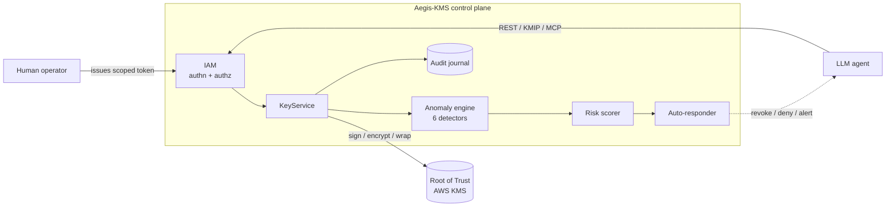

<div align="center">


# Aegis-KMS

**An agent-aware open-source key management service.**

*Identity, audit, and real-time control for an era when LLM agents call your sign / encrypt APIs.*

[](LICENSE)
[](https://sharma-bhaskar.github.io/aegis-kms/about/status/)
[](https://github.com/sharma-bhaskar/aegis-kms/releases)
[](https://github.com/sharma-bhaskar/aegis-kms/actions/workflows/ci.yml)
[](https://sharma-bhaskar.github.io/aegis-kms/)

[Documentation](https://sharma-bhaskar.github.io/aegis-kms/) ·
[Quickstart](https://sharma-bhaskar.github.io/aegis-kms/getting-started/quickstart/) ·
[Architecture](https://sharma-bhaskar.github.io/aegis-kms/ARCHITECTURE/) ·
[Changelog](CHANGELOG.md) ·
[Roadmap](ROADMAP.md)

</div>

---

> **v0.2.1 — pre-alpha.** The crypto surface is real and end-to-end (sign / verify / encrypt /
> decrypt / wrap / unwrap / rotate / compromise) on REST + CLI + SDK, with JWT + OIDC auth,
> Postgres / MySQL / SQLite event journals, Prometheus metrics, OpenTelemetry tracing, OpenAPI on
> `/docs/`, and the full wedge: a baseline anomaly engine + honey-key trip wire feeding a risk
> scorer, decision adapter, and auto-responder, plus agent-token issuance, Redis-backed JWT
> revocation, SIEM / Kafka / NATS audit fan-out, and a read-only LLM advisor (`advisor scan` /
> `advisor explain`, with pluggable Anthropic / OpenAI / Ollama narration). Multi-cloud
> root-of-trust (GCP / Azure / Vault), KMIP, and the MCP-native server land in v0.3.0+. See
> [the status table](https://sharma-bhaskar.github.io/aegis-kms/about/status/)
> for the per-capability split.

## 🤔 Why Aegis exists

AI agents — Claude, GPT, custom agents, RAG workloads — now sign payloads, decrypt secrets, and
call tools that hold real credentials. None of the existing key managers were built for this:
when something goes wrong, the audit log says *"role `billing-signer` made 80 sign calls"* and
can't tell you *which agent did it, on whose behalf, or whether the burst is anomalous*.

Aegis is the agent-native control plane that sits **in front of** an existing KMS (AWS KMS today;
GCP / Azure / Vault in v0.3.0) and adds the four things role-centric KMSes don't:

1. **Per-agent identity** — every request resolves to a `Principal.Agent` with a back-pointer to
   the human who issued it, an explicit scope, and a TTL.
2. **Behavioural baselines** — detectors flag scope violations, rate spikes, off-hours access,
   new source IPs, operations the actor has never performed, and touches on honey keys.
3. **Structured audit** — every decision, score, and detection lands in an immutable journal with
   full agent + parent attribution.
4. **Real-time response** — configurable wiring from detection to action: allow / step-up / deny /
   rotate / revoke / alert, applied before the next request lands.

## 🔎 How it works


```mermaid
flowchart LR
    Human["Human operator"] -->|issues scoped token| IAM
    Agent["LLM agent"] -->|"REST / KMIP / MCP"| IAM

    subgraph plane["Aegis-KMS control plane"]
        direction TB
        IAM["IAM<br/>authn + authz"] --> KS["KeyService"]
        KS --> Engine["Anomaly engine<br/>6 detectors"]
        Engine --> Risk["Risk scorer"]
        Risk --> Auto["Auto-responder"]
        KS --> Audit[("Audit journal")]
    end

    KS -->|"sign / encrypt / wrap"| RoT[("Root of Trust<br/>AWS KMS")]
    Auto -.->|"revoke / deny / alert"| Agent
```

Every wire plane (REST, KMIP, MCP, Agent-AI) terminates at one `KeyService[F[_]]` algebra; the
request lifecycle is identical after framing: **plane → IAM → KeyService → [persistence + RoT] →
audit**. Persistence commits before the audit event is emitted, so the audit log can never
describe a key the journal doesn't have.

## ✨ What you get

| | |
|---|---|
| 🔑 **Full crypto surface** | sign / verify · encrypt / decrypt (AAD) · wrap / unwrap · rotate · compromise — REST + CLI, AWS KMS-backed |
| 🪪 **Per-agent identity** | every call resolves to a `Principal.Agent` with issuing human, scope, and TTL; JWT (HS256) + OIDC / JWKS |
| 🕵️ **Anomaly detection** | 6 detectors — scope, rate-spike, op-histogram, time-of-day, source-IP, + honey-key trip wire |
| ⚡ **Real-time response** | risk scorer → decision (allow / step-up / deny) → auto-responder (revoke / alert), before the next request |
| 📜 **Structured audit** | immutable journal with full agent + parent attribution; `GET /v1/audit`; fan-out to Postgres / SIEM / Kafka / NATS |
| 🔌 **Embeddable** | the pure `KeyService[F[_]]` algebra in `aegis-core` has zero Pekko — drop it into any JVM app |

## ⚖️ Aegis vs a role-centric KMS

| When an agent misbehaves… | AWS KMS / Vault | Aegis-KMS |
|---|---|---|
| **Who made the call?** | `role billing-signer` | `agent claude-7f3` ← issued by `alice@org` |
| **Is this burst anomalous?** | — | 6 behavioural detectors + numeric risk score |
| **Stop it mid-incident** | manual key disable | auto-revoke the key out from under the agent on a High-severity detection |
| **Canary / honey keys** | — | trip wire fires on the first agent touch |

Aegis doesn't replace your cryptographic root of trust — it adds the agent-aware control plane on
top of it.

## 🚀 Quickstart — Docker Compose

Brings up `aegis-server` against a local Postgres in two commands. Requires Docker.

```bash
git clone https://github.com/sharma-bhaskar/aegis-kms.git
cd aegis-kms
export POSTGRES_PASSWORD="$(openssl rand -base64 24)"
docker compose -f deploy/docker/docker-compose.yml up
```

In another shell:

```bash
# Create a key (dev auth via X-Aegis-User header)
curl -X POST http://localhost:8080/v1/keys \
  -H 'Content-Type: application/json' -H 'X-Aegis-User: alice' \
  -d '{"spec":{"name":"invoice-signing","algorithm":"AES","sizeBits":256,"objectType":"SymmetricKey"}}'

# OpenAPI / Swagger UI for the full surface
open http://localhost:8080/docs/
```

For JWT auth, embedding-as-a-library, the CLI, observability wiring, and a full walkthrough — see
the [docs site](https://sharma-bhaskar.github.io/aegis-kms/).

## 📚 Documentation

Full docs at **[sharma-bhaskar.github.io/aegis-kms](https://sharma-bhaskar.github.io/aegis-kms/)**:

- 🏁 **[Quickstart](https://sharma-bhaskar.github.io/aegis-kms/getting-started/quickstart/)** — Docker, library, and CLI walkthroughs
- 🏛️ **[Architecture](https://sharma-bhaskar.github.io/aegis-kms/ARCHITECTURE/)** — two-tier module split, request lifecycle, state machine, audit model
- 🧭 **[Usage walkthrough](https://sharma-bhaskar.github.io/aegis-kms/USAGE/)** — every operation, end to end
- 🛡️ **[Operations](https://sharma-bhaskar.github.io/aegis-kms/operations/security/)** — auth, deployment, observability, security
- 👷 **[Developer Guide](https://sharma-bhaskar.github.io/aegis-kms/development/developer-guide/)** — build, test, debug, contribute

> **REST API:** the live OpenAPI 3.1 spec + Swagger UI are served at `http://localhost:8080/docs/`
> on a running server.

<details>
<summary>📦 <b>Modules</b> — Scala 3 / sbt multi-project, two-tier split</summary>

<br>

The build enforces a **two-tier split**: library-tier modules have zero Pekko on the classpath and
embed in any JVM app; server-tier modules add the actor system, HTTP, and process boot.

| Module | Tier | What it is |
|---|---|---|
| `aegis-core` | Library | `KeyService[F[_]]` algebra, ADTs, no I/O |
| `aegis-iam` | Library | Principal + JWT / OIDC verification + authorization decorator |
| `aegis-audit` | Library | `AuditSink` SPI + auditing decorator |
| `aegis-crypto` | Library | `RootOfTrust` SPI + AWS KMS and JCE-backed software adapters |
| `aegis-persistence` | Library | Doobie event journal (Postgres / MySQL / SQLite / in-memory) |
| `aegis-sdk-scala` / `aegis-sdk-java` | Library | Client SDKs — full REST coverage (Scala) + pure-Java facade |
| `aegis-http` | Server | Tapir REST + OpenAPI 3.1 |
| `aegis-agent-ai` | Server | Anomaly engine + risk scorer + auto-responder |
| `aegis-server` | Server | Boot wiring, Prometheus, OTel, Pekko actor |
| `aegis-cli` | Server | `aegis` admin CLI |
| `aegis-kmip`, `aegis-mcp-server` | Server | Skeletons — v0.4.0 |

</details>

## 🗺️ Status

**v0.2.1 (latest, pre-alpha)** — the agent-aware wedge, end-to-end, plus the LLM advisor.

<details>
<summary>Per-release breakdown</summary>

<br>

- **v0.1.1** — full crypto surface, observability (Prometheus + OTel), 5-detector anomaly engine.
- **v0.2.0** — risk scorer, decision adapter, auto-responder, honey keys; agent-token
  issuance + OIDC / JWKS; Redis JWT revocation; role-based policy engine; Postgres audit table +
  `GET /v1/audit`; SIEM / Kafka / NATS audit fan-out; MySQL + SQLite journals.
- **v0.2.1** *(latest)* — read-only LLM advisor: deterministic `advisor scan` triage,
  `advisor explain` agent timeline, pluggable Anthropic / OpenAI / Ollama narration.
- **v0.3.0+** — multi-cloud root-of-trust (GCP / Azure / Vault), Helm chart, time-windowed access;
  then KMIP wire plane + MCP-native server (v0.4.0).

Full detail → [ROADMAP.md](ROADMAP.md) ·
[Status page](https://sharma-bhaskar.github.io/aegis-kms/about/status/) ·
[CHANGELOG.md](CHANGELOG.md)

</details>

## 🤝 Contributing

Aegis welcomes contributions under Apache-2.0. Every commit must be DCO-signed (`git commit -s`);
the library tier must remain Pekko-free; CHANGELOG updates land in the same PR as the change.

- **[CONTRIBUTING.md](CONTRIBUTING.md)** — ground rules, PR checklist, code style
- **[Developer Guide](https://sharma-bhaskar.github.io/aegis-kms/development/developer-guide/)** — full local-dev workflow
- **[Good first issues](https://github.com/sharma-bhaskar/aegis-kms/issues?q=is%3Aopen+is%3Aissue+label%3A%22good+first+issue%22)** — labeled on the issue tracker

## 🔒 Security

Please do **not** open a public issue for a security report. See [SECURITY.md](SECURITY.md) for the
disclosure process and the deploy-time configuration matrix.

Deploying for real? Set `AEGIS_SECURITY_PREFLIGHT=enforce` — the boot preflight then refuses to
bind a network-reachable address while dev-grade settings (dev auth / dev policy, in-memory
crypto / journal) are active, instead of just printing a warning banner.

## 📄 License

Apache-2.0 — see [LICENSE](LICENSE).
