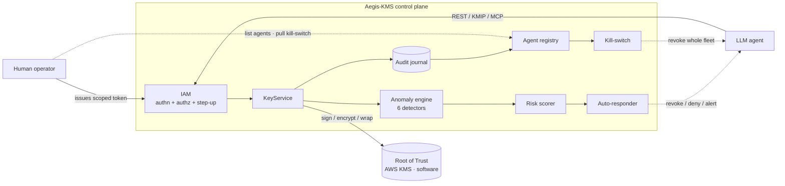

<div align="center">


# Aegis-KMS

**An agent-aware open-source key management service.**

*Identity, audit, and real-time control for an era when LLM agents call your sign / encrypt APIs.*

[](LICENSE)
[](https://sharma-bhaskar.github.io/aegis-kms/about/status/)
[](https://github.com/sharma-bhaskar/aegis-kms/releases)
[](https://github.com/sharma-bhaskar/aegis-kms/actions/workflows/ci.yml)
[](https://sharma-bhaskar.github.io/aegis-kms/)

[Documentation](https://sharma-bhaskar.github.io/aegis-kms/) ·
[Quickstart](https://sharma-bhaskar.github.io/aegis-kms/getting-started/quickstart/) ·
[Architecture](https://sharma-bhaskar.github.io/aegis-kms/ARCHITECTURE/) ·
[Changelog](CHANGELOG.md) ·
[Roadmap](ROADMAP.md)

</div>

---

> **Pre-alpha.** Latest release **v0.2.1**; `main` is ahead with the v0.3.0 work listed below.
>
> **Shipped and end-to-end:** the full crypto surface (sign / verify · encrypt / decrypt · wrap /
> unwrap · rotate · compromise) on REST + CLI + SDK · JWT + OIDC auth · Postgres / MySQL / SQLite
> journals · Prometheus + OpenTelemetry · OpenAPI at `/docs/` · and the wedge itself — 6 anomaly
> detectors and a honey-key trip wire feeding a risk scorer, decision adapter, and auto-responder,
> plus agent-token issuance, Redis-backed JWT revocation, SIEM / Kafka / NATS audit fan-out, and a
> read-only LLM advisor.
>
> **On `main`, not yet released:** agent registry + fleet kill-switch + step-up authentication,
> a JCE software root-of-trust (real crypto, no cloud account), working SDK clients, and a
> production boot preflight.
>
> **Next:** multi-cloud root-of-trust (GCP / Azure / Vault) and a Helm chart in v0.3.0; the KMIP
> wire plane and MCP-native server in v0.4.0.
> [Per-capability status →](https://sharma-bhaskar.github.io/aegis-kms/about/status/)

## 🤔 Why Aegis exists

AI agents — Claude, GPT, custom agents, RAG workloads — now sign payloads, decrypt secrets, and
call tools that hold real credentials. None of the existing key managers were built for this:
when something goes wrong, the audit log says *"role `billing-signer` made 80 sign calls"* and
can't tell you *which agent did it, on whose behalf, or whether the burst is anomalous*.

Aegis is the agent-native control plane that sits **in front of** your existing root of trust
(AWS KMS or a JCE software backend today; GCP / Azure / Vault next) and adds the four things
role-centric KMSes don't:

1. **Per-agent identity** — every request resolves to a `Principal.Agent` with a back-pointer to
   the human who issued it, an explicit scope, and a TTL.
2. **Behavioural baselines** — detectors flag scope violations, rate spikes, off-hours access,
   new source IPs, operations the actor has never performed, and touches on honey keys.
3. **Structured audit** — every decision, score, and detection lands in an immutable journal with
   full agent + parent attribution.
4. **Real-time response** — allow / step-up / deny / rotate / revoke / alert, applied before the
   next request lands — down to killing every agent an operator ever spawned, in one call.

## 🔎 How it works


```mermaid
flowchart LR
    Human["Human operator"] -->|issues scoped token| IAM
    Agent["LLM agent"] -->|"REST / KMIP / MCP"| IAM

    subgraph plane["Aegis-KMS control plane"]
        direction TB
        IAM["IAM<br/>authn + authz + step-up"] --> KS["KeyService"]
        KS --> Engine["Anomaly engine<br/>6 detectors"]
        Engine --> Risk["Risk scorer"]
        Risk --> Auto["Auto-responder"]
        KS --> Audit[("Audit journal")]
        Audit --> Registry["Agent registry"]
        Registry --> Kill["Kill-switch"]
    end

    KS -->|"sign / encrypt / wrap"| RoT[("Root of Trust<br/>AWS KMS · software")]
    Auto -.->|"revoke / deny / alert"| Agent
    Kill -.->|"revoke whole fleet"| Agent
    Human -.->|"list agents · pull kill-switch"| Registry
```

Every wire plane (REST, KMIP, MCP, Agent-AI) terminates at one `KeyService[F[_]]` algebra; the
request lifecycle is identical after framing: **plane → IAM → KeyService → [persistence + RoT] →
audit**. Persistence commits before the audit event is emitted, so the audit log can never
describe a key the journal doesn't have.

## ✨ What you get

| | |
|---|---|
| 🔑 **Full crypto surface** | sign / verify · encrypt / decrypt (AAD) · wrap / unwrap · rotate · compromise — REST + CLI, backed by AWS KMS or a JCE software root of trust |
| 🪪 **Per-agent identity** | every call resolves to a `Principal.Agent` with issuing human, scope, and TTL; JWT (HS256) + OIDC / JWKS |
| 📇 **Agent registry** | `GET /v1/agents` — who spawned what, its scopes, expiry, last activity, and whether it's still live |
| 🛑 **Fleet kill-switch** | `POST /v1/agents/revoke` — stop every agent an operator ever spawned in one call, step-up gated |
| 🕵️ **Anomaly detection** | 6 detectors — scope, rate-spike, op-histogram, time-of-day, source-IP, + honey-key trip wire |
| ⚡ **Real-time response** | risk scorer → decision (allow / step-up / deny) → auto-responder (revoke / alert), before the next request |
| 📜 **Structured audit** | immutable journal with full agent + parent attribution; `GET /v1/audit`; fan-out to Postgres / SIEM / Kafka / NATS |
| 🔌 **Embeddable** | the pure `KeyService[F[_]]` algebra in `aegis-core` has zero Pekko — drop it into any JVM app |

## ⚖️ Aegis vs a role-centric KMS

| When an agent misbehaves… | AWS KMS / Vault | Aegis-KMS |
|---|---|---|
| **Who made the call?** | `role billing-signer` | `agent claude-7f3` ← issued by `alice@org` |
| **What else is out there?** | grep the CloudTrail logs | `aegis agent list` — every live agent, its parent, scopes, and last activity |
| **Is this burst anomalous?** | — | 6 behavioural detectors + numeric risk score |
| **Stop it mid-incident** | manual key disable | auto-revoke the key out from under the agent on a High-severity detection |
| **Stop *everything* it spawned** | script over the audit log | `aegis agent revoke --parent alice@org` — one call, step-up gated |
| **Canary / honey keys** | — | trip wire fires on the first agent touch |

Aegis doesn't replace your cryptographic root of trust — it adds the agent-aware control plane on
top of it.

## 🚀 Quickstart — Docker Compose

Brings up `aegis-server` against a local Postgres in two commands. Requires Docker.

```bash
git clone https://github.com/sharma-bhaskar/aegis-kms.git
cd aegis-kms
export POSTGRES_PASSWORD="$(openssl rand -base64 24)"
docker compose -f deploy/docker/docker-compose.yml up
```

In another shell — create a key, hand an agent a scoped credential, then see what it can do:

```bash
export AEGIS=http://localhost:8080

# 1. A key.
curl -s -X POST "$AEGIS/v1/keys" \
  -H 'Content-Type: application/json' -H 'X-Aegis-User: alice' \
  -d '{"spec":{"name":"invoice-signing","algorithm":"AES","sizeBits":256,"objectType":"SymmetricKey"}}'

# 2. A short-lived agent credential, scoped to two operations, owned by alice.
curl -s -X POST "$AEGIS/v1/agents/issue" \
  -H 'Content-Type: application/json' -H 'X-Aegis-User: alice' \
  -d '{"label":"claude-invoice-batch","scopes":["Sign","Get"],"ttlSeconds":3600}'

# 3. The question no role-centric KMS can answer: what is out there right now?
curl -s "$AEGIS/v1/agents" -H 'X-Aegis-User: alice' | jq
```

```json
{
  "agents": [
    { "agentId": "agent-7a3f1e25-…", "label": "claude-invoice-batch", "parent": "alice",
      "scopes": ["Get", "Sign"], "expiresAt": "2026-08-05T13:10:00Z",
      "lastSeenAt": null, "status": "Active" }
  ],
  "activeCount": 1
}
```

`lastSeenAt: null` means the credential was minted but never used — worth noticing on its own,
since an unused agent token is pure standing risk.

When something goes wrong, one call stops **everything** that operator spawned:

```bash
aegis agent revoke --parent alice@org --issued-after 2026-08-05T11:00:00Z
```

That endpoint is **step-up gated** — your credential must carry an `amr` proving a strong
authentication method and an `auth_time` inside the freshness window, so it won't work with the
dev-mode header above. It answers a 401 with a real `WWW-Authenticate: aegis-stepup …` challenge
naming what's missing. See [Step 14c of the walkthrough](docs/USAGE.md) for the full flow.

The complete REST surface, including live OpenAPI 3.1 and Swagger UI:

```bash
open http://localhost:8080/docs/
```

For JWT auth, embedding-as-a-library, the CLI, and observability wiring — see the
[docs site](https://sharma-bhaskar.github.io/aegis-kms/).

## 📚 Documentation

Full docs at **[sharma-bhaskar.github.io/aegis-kms](https://sharma-bhaskar.github.io/aegis-kms/)**:

- 🏁 **[Quickstart](https://sharma-bhaskar.github.io/aegis-kms/getting-started/quickstart/)** — Docker, library, and CLI walkthroughs
- 🏛️ **[Architecture](https://sharma-bhaskar.github.io/aegis-kms/ARCHITECTURE/)** — two-tier module split, request lifecycle, state machine, audit model
- 🧭 **[Usage walkthrough](https://sharma-bhaskar.github.io/aegis-kms/USAGE/)** — every operation, end to end
- 🛡️ **[Operations](https://sharma-bhaskar.github.io/aegis-kms/operations/security/)** — auth, deployment, observability, security
- 👷 **[Developer Guide](https://sharma-bhaskar.github.io/aegis-kms/development/developer-guide/)** — build, test, debug, contribute

> **REST API:** the live OpenAPI 3.1 spec + Swagger UI are served at `http://localhost:8080/docs/`
> on a running server.

<details>
<summary>📦 <b>Modules</b> — Scala 3 / sbt multi-project, two-tier split</summary>

<br>

The build enforces a **two-tier split**: library-tier modules have zero Pekko on the classpath and
embed in any JVM app; server-tier modules add the actor system, HTTP, and process boot.

| Module | Tier | What it is |
|---|---|---|
| `aegis-core` | Library | `KeyService[F[_]]` algebra, ADTs, no I/O |
| `aegis-iam` | Library | Principal + JWT / OIDC verification, authorization decorator, step-up policy |
| `aegis-audit` | Library | `AuditSink` SPI + auditing decorator |
| `aegis-crypto` | Library | `RootOfTrust` SPI + AWS KMS and JCE-backed software adapters |
| `aegis-crypto-gcp` | Library | GCP Cloud KMS adapter — separate artifact so the SPI stays dependency-light |
| `aegis-persistence` | Library | Doobie event journal (Postgres / MySQL / SQLite / in-memory) |
| `aegis-sdk-scala` / `aegis-sdk-java` | Library | Client SDKs — full REST coverage (Scala) + pure-Java facade |
| `aegis-http` | Server | Tapir REST + OpenAPI 3.1 |
| `aegis-agent-ai` | Server | Anomaly engine + risk scorer + auto-responder + agent registry / kill-switch |
| `aegis-server` | Server | Boot wiring, Prometheus, OTel, Pekko actor |
| `aegis-cli` | Server | `aegis` admin CLI |
| `aegis-kmip`, `aegis-mcp-server` | Server | Skeletons — v0.4.0 |

</details>

## 🗺️ Status

**v0.2.1** is the latest release. `main` is ahead — the v0.3.0 governance work has landed but is
not yet tagged.

<details>
<summary>Per-release breakdown</summary>

<br>

- **v0.1.1** — full crypto surface, observability (Prometheus + OTel), 5-detector anomaly engine.
- **v0.2.0** — risk scorer, decision adapter, auto-responder, honey keys; agent-token
  issuance + OIDC / JWKS; Redis JWT revocation; role-based policy engine; Postgres audit table +
  `GET /v1/audit`; SIEM / Kafka / NATS audit fan-out; MySQL + SQLite journals.
- **v0.2.1** *(latest release)* — read-only LLM advisor: deterministic `advisor scan` triage,
  `advisor explain` agent timeline, pluggable Anthropic / OpenAI / Ollama narration.
- **v0.2.2** *(on `main`)* — working SDK clients (both previously threw on their only entry
  point); production boot preflight that refuses dev-grade settings on a public bind.
- **v0.3.0** *(in progress on `main`)* — JCE software root-of-trust (real crypto, no cloud
  account); agent registry (`GET /v1/agents`); fleet kill-switch (`POST /v1/agents/revoke`);
  step-up authentication. Still open: GCP / Azure / Vault adapters, Helm chart,
  time-windowed access policies.
- **v0.4.0** — KMIP wire plane + MCP-native server.

Full detail → [ROADMAP.md](ROADMAP.md) ·
[Status page](https://sharma-bhaskar.github.io/aegis-kms/about/status/) ·
[CHANGELOG.md](CHANGELOG.md)

</details>

## 🤝 Contributing

Aegis welcomes contributions under Apache-2.0. Every commit must be DCO-signed (`git commit -s`);
the library tier must remain Pekko-free; CHANGELOG updates land in the same PR as the change.

- **[CONTRIBUTING.md](CONTRIBUTING.md)** — ground rules, PR checklist, code style
- **[Developer Guide](https://sharma-bhaskar.github.io/aegis-kms/development/developer-guide/)** — full local-dev workflow
- **[Good first issues](https://github.com/sharma-bhaskar/aegis-kms/issues?q=is%3Aopen+is%3Aissue+label%3A%22good+first+issue%22)** — labeled on the issue tracker

## 🔒 Security

Please do **not** open a public issue for a security report. See [SECURITY.md](SECURITY.md) for the
disclosure process and the deploy-time configuration matrix.

Deploying for real? Two settings worth knowing:

- **`AEGIS_SECURITY_PREFLIGHT=enforce`** — the boot preflight then *refuses to start* when
  dev-grade settings (dev auth / dev policy, in-memory or software crypto, in-memory journal)
  would bind a network-reachable address, instead of printing a warning banner. A crashed pod is
  cheaper than an open KMS.
- **`AEGIS_SECURITY_STEP_UP_METHODS`** — which OIDC `amr` values count as a genuine step-up for
  the kill-switch. The default set excludes `pwd` on purpose: a password is what the user already
  presented to get the session, so accepting it would make step-up ceremonial.

## 📄 License

Apache-2.0 — see [LICENSE](LICENSE).
