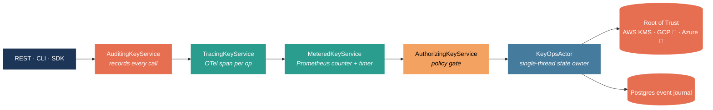

# Aegis-KMS

**An open-source, agent-aware key management service.**

Identity, audit, and real-time control for an era when LLM agents call your sign / encrypt
APIs and the role-centric audit log can't tell you *which* agent did *what*.

[Get started in 2 minutes :material-arrow-right:](getting-started/quickstart.md){ .md-button .md-button--primary }
[Read the architecture :material-arrow-right:](ARCHITECTURE.md){ .md-button }

---

## Why Aegis exists

AI agents — Claude, GPT, custom agents, RAG workloads — now sign payloads, decrypt secrets, and
call tools that hold real credentials. None of the existing key managers were built for this.

When something goes wrong, the audit log says *"role `billing-signer` made 80 sign calls"* and
can't tell you *which agent did it, on whose behalf, or whether the burst is anomalous*. The
problem is structural: every existing KMS — AWS KMS, GCP KMS, Azure Key Vault, HashiCorp Vault,
OpenBao — is built around a role-centric model that pre-dates LLM agents in production.

Aegis is the agent-native control plane that sits in front of an existing KMS (AWS KMS today;
GCP / Azure / Vault adapters in v0.2.0) and adds the four things role-centric KMSes don't:

<div class="grid cards" markdown>

-   :material-account-key:{ .lg .middle } **Per-agent identity**

    ---

    Every request resolves to a `Principal.Agent` with a back-pointer to the human who issued
    it, an explicit scope, and a TTL — not a shared service-account credential.

-   :material-chart-bell-curve:{ .lg .middle } **Behavioural baselines**

    ---

    Five detectors flag scope violations, rate spikes, off-hours access, new source IPs, and
    operations the actor has never performed.

-   :material-shield-check:{ .lg .middle } **Structured audit**

    ---

    Every decision, score, and detection lands in an immutable journal with full agent +
    parent attribution and full request context.

-   :material-flash:{ .lg .middle } **Real-time response**

    ---

    Risk scorer (`risk.score` + `risk.factors` on every audit row), decision adapter
    (`Allow` / `StepUp` / `Deny`), and auto-responder (default High → `Revoke`) — all wired
    end-to-end on `main`. Try it in the [wedge demo](getting-started/quickstart.md#step-15--trigger-a-rate-spike-anomaly).

</div>

## How a request flows through Aegis

Every operation — whether it arrives over REST, the CLI, or (eventually) MCP — passes through the same set of decorators around the `KeyService` algebra. Each layer does one thing and one thing only:



- **Audit is outermost** so denied calls + errors still produce a row.
- **Auth is innermost** of the decorators so a deny short-circuits before any real work.
- **Tracing + metrics** sit between them so dashboards see the work that actually happened, while the audit row reflects the post-trace outcome.

## Quickstart in 30 seconds

```bash
git clone https://github.com/sharma-bhaskar/aegis-kms.git
cd aegis-kms
export POSTGRES_PASSWORD="$(openssl rand -base64 24)"
docker compose -f deploy/docker/docker-compose.yml up
```

Server is now at `http://localhost:8080`. Swagger UI lives at `http://localhost:8080/docs/`.
Full walkthrough → [Getting Started → Quickstart](getting-started/quickstart.md).

## What ships today

This table reflects what's on `main` right now. v0.1.1 is the last released artifact; the rows
marked "v0.2.0 in progress" are committed and tested on `main` and will land in the next tag.

| Surface | Status |
|---|---|
| REST `/v1/keys/*` (create, get, activate, destroy, sign, verify, encrypt, decrypt, wrap, unwrap, rotate, compromise) | :material-check: Shipped |
| `aegis` admin CLI for the same surface | :material-check: Shipped |
| JWT bearer auth (HS256) + dev `X-Aegis-User` header | :material-check: Shipped |
| Postgres event journal (in-memory option for dev) | :material-check: Shipped |
| AWS KMS `RootOfTrust` adapter | :material-check: Shipped |
| 5-detector anomaly engine (scope, rate, op-histogram, time-of-day, source-IP) | :material-check: Shipped |
| Prometheus `/metrics` + JVM standard collectors | :material-check: Shipped |
| OpenTelemetry tracing (auto-configured SDK) | :material-check: Shipped |
| OpenAPI 3.1 spec + Swagger UI on `/docs/` | :material-check: Shipped |
| `Resource[IO, Unit]` boot scope for graceful shutdown | :material-check: Shipped |
| Risk scorer (`RiskScorer` SPI; baseline + contextual factors stamped on every audit row) | :material-check: Shipped (v0.2.0) |
| Decision adapter (`Allow` / `StepUp` / `Deny`; HTTP 401 / 403 with reason) | :material-check: Shipped (v0.2.0) |
| Auto-responder (default High → Revoke, Medium → Alert; configurable rules + 60 s cooldown) | :material-check: Shipped (v0.2.0) |
| KMIP wire plane | :material-progress-clock: v0.2.0 |
| MCP-native server | :material-progress-clock: v0.2.0 |
| Agent-token issuance endpoint (`POST /v1/agents/issue`) + OIDC verifier | :material-progress-clock: v0.2.0 |
| Source IP populated on audit records by the HTTP layer | :material-progress-clock: v0.2.0 |
| GCP / Azure / Vault `RootOfTrust` adapters | :material-progress-clock: v0.2.0 |
| SIEM / Kafka / Postgres audit fan-out | :material-progress-clock: v0.3.0 |
| Helm chart, auto-rotation scheduler | :material-progress-clock: v0.3.0 |

Full per-release breakdown → [Roadmap](about/roadmap.md). What changed when → [Changelog](about/changelog.md).

## Where to go next

<div class="grid cards" markdown>

-   :material-rocket-launch: **First time?**

    ---

    Run the [Quickstart](getting-started/quickstart.md), then read the [Architecture](ARCHITECTURE.md)
    page to understand how Aegis fits in front of your existing KMS.

-   :material-server: **Operating Aegis?**

    ---

    [Observability](operations/observability.md) covers Prometheus + OTel wiring.
    [Security](operations/security.md) covers deploy-time configuration.

-   :material-code-tags: **Contributing?**

    ---

    The [Developer Guide](development/developer-guide.md) walks through setup, testing,
    architecture, and the PR flow end-to-end.

-   :material-compare: **Evaluating Aegis?**

    ---

    [Comparison with AWS KMS / Vault / OpenBao](about/comparison.md) — including a clear
    "do not pick Aegis if…" section.

</div>

---

## License

Apache-2.0. See [LICENSE](https://github.com/sharma-bhaskar/aegis-kms/blob/main/LICENSE).

## Status

v0.1.1 — pre-alpha. Not production-ready; looking for design partners through v1.0. The full
status disclosure is on the [Status](about/status.md) page.
